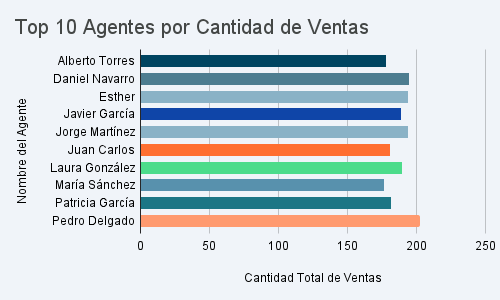
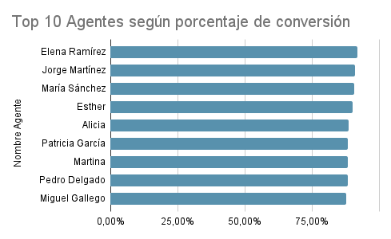
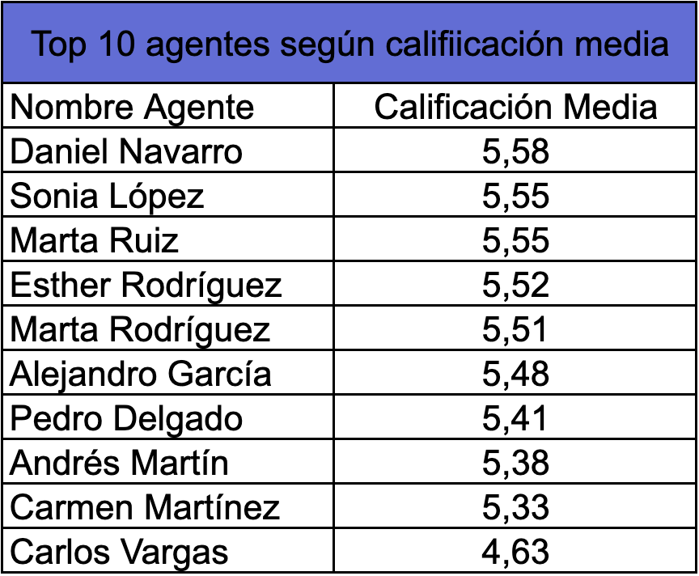
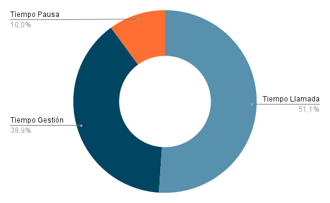

📊 Optimización del Rendimiento - Call Center "Arcoiris"
Este proyecto consiste en un análisis integral de performance operativa (Business Intelligence) aplicado a un dataset de un Call Center con más de 9.800 registros.
El objetivo principal fue transformar datos crudos en información visual y estratégica, permitiendo identificar patrones de eficiencia, calidad de atención y productividad del equipo. A través del uso de herramientas avanzadas de Google Sheets/Excel, se desarrolló un tablero de control (Dashboard) diseñado para:
-Monitorear KPIs críticos (Conversión, Calidad y Tiempos) de forma ágil.
-Optimizar la evaluación de desempeño, basándose en métricas objetivas y no solo en volúmenes de llamadas.

📋 Contexto del Proyecto
El dataset comprende una operación de 9.827 llamadas procesadas, distribuidas en 600 registros de actividad diaria de 50 agentes durante un periodo de 12 días.

📖 Glosario de Métricas (Diccionario de Datos)
Para garantizar la consistencia en el análisis, se definieron los siguientes conceptos clave:

min_llamada (Talk Time): Tiempo neto de conversación con el cliente. Mide la interacción directa.

min_gestion (After Call Work - ACW): Tiempo administrativo posterior a la llamada (carga de pedidos, notas, etc)

min_pausa: Tiempo de descanso programado.

calificacion: Feedback del cliente en escala 1-6.

🛠️ Stack Tecnológico

Excel / Google Sheets: Utilizado para el procesamiento de datos mediante Tablas Dinámicas y la creación de un Dashboard de control operativo con gráficos de distribución porcentual y rankings de performance.

🚀 Análisis y Hallazgos Principales
Identificación de Perfiles de Alto Desempeño: Se implementó un modelo de scoring para detectar al "Agente del Mes", priorizando la tasa de conversión y la satisfacción del cliente.

Hallazgo: Se identificó que los agentes con mayor volumen de ventas no siempre poseen la mejor calidad. El perfil seleccionado (Esther Rodríguez) logró un equilibrio óptimo con un 90% de conversión y una calificación de 5.5/6

Eficiencia Operativa y Distribución del Tiempo
El análisis de la jornada permitió visualizar cómo se distribuye el tiempo entre la atención directa, las tareas administrativas y los descansos.

📈 Conclusiones
Identificación del talento: Este análisis permite destacar a los agentes que logran un equilibrio real entre ventas y servicio al cliente. Así, el reconocimiento al "Agente del Mes" se basa en resultados medibles y objetivos, y no solo en impresiones generales.

Claridad en el uso del tiempo: Al visualizar los datos en gráficos de anillos y barras, se puede entender rápidamente cómo se distribuye la jornada. Es mucho más sencillo ver cuánto tiempo se dedica a hablar con clientes y cuánto se destina a tareas administrativas o descansos.

Decisiones basadas en datos: Pasamos de suponer qué pasa en el equipo a tener una foto clara de la operación.